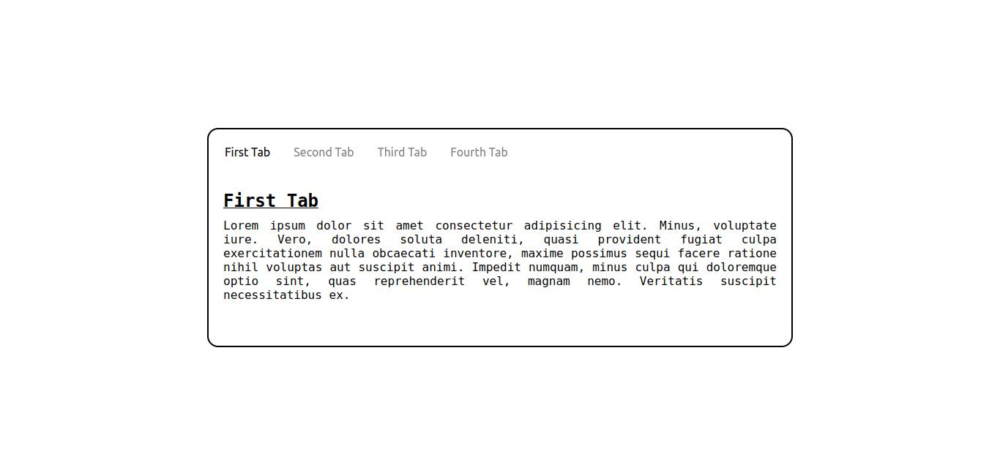
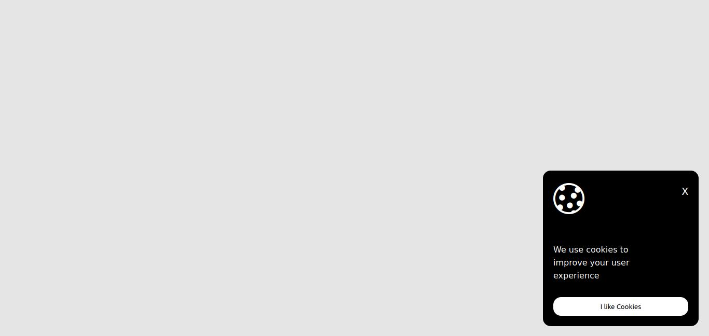
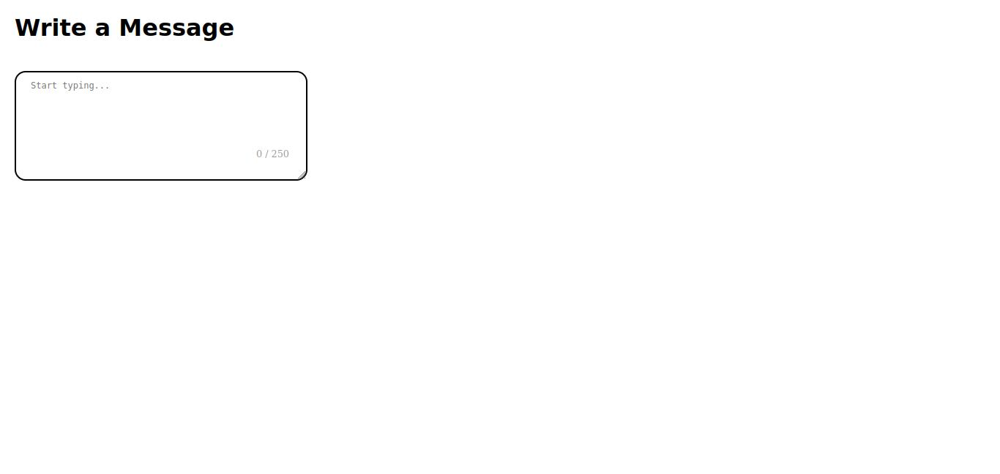

# Front-end Projects from Roadmap.sh

---

In this repository contains front-end projects built following the [roadmap.sh](https://roadmap.sh/frontend) front-end developer path.

---

## Projects List

---

1. [Tabs](/Frontend/1-Tabs/)  
2. [Cookie Consent](/Frontend/2-Cookie-Consent/)  
3. [Restricted Textarea](/Frontend/3-Restricted-Textarea/)  

Click any of the images below to view the readme and live demo of the project.

### Preview

  
  
  

